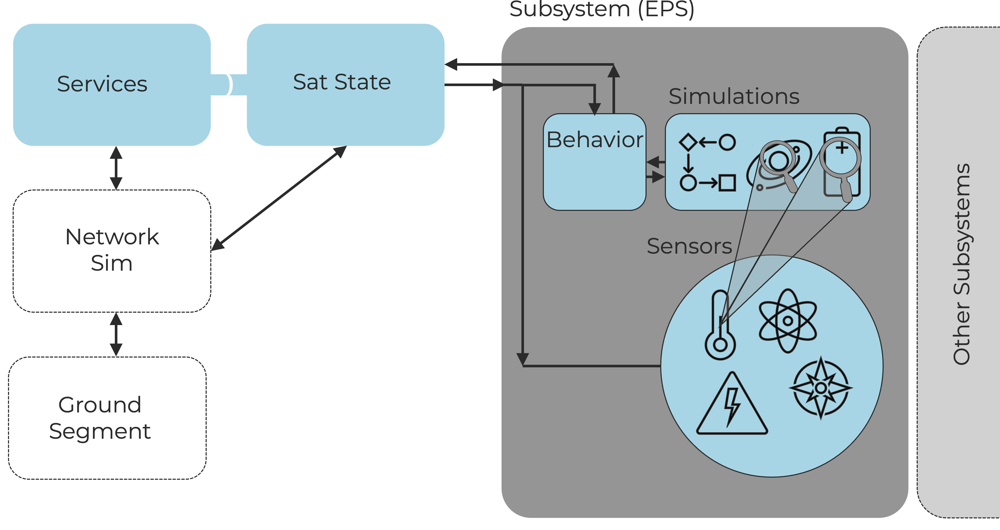

<!--
Hey, thanks for using the awesome-readme-template template.  
If you have any enhancements, then fork this project and create a pull request 
or just open an issue with the label "enhancement".

Don't forget to give this project a star for additional support ;)
Maybe you can mention me or this repo in the acknowledgements too
-->
<div align="center">

  
  <h1>HoneySat's Satellite Simulator</h1>
  
  <p>
    Simulation suite capable of simulating the physical processes, subsystems and sensors of a real satellite 
  </p>
  
  
<!-- Badges
<p>
  <a href="https://github.com/Louis3797/awesome-readme-template/graphs/contributors">
    
  </a>
  <a href="">
    
  </a>
  <a href="https://github.com/Louis3797/awesome-readme-template/network/members">
    
  </a>
  <a href="https://github.com/Louis3797/awesome-readme-template/stargazers">
    
  </a>
  <a href="https://github.com/Louis3797/awesome-readme-template/issues/">
    
  </a>
  <a href="https://github.com/Louis3797/awesome-readme-template/blob/master/LICENSE">
    
  </a>
</p>
   
<h4>
    <a href="https://github.com/Louis3797/awesome-readme-template/">View Demo</a>
  <span> · </span>
    <a href="https://github.com/Louis3797/awesome-readme-template">Documentation</a>
  <span> · </span>
    <a href="https://github.com/Louis3797/awesome-readme-template/issues/">Report Bug</a>
  <span> · </span>
    <a href="https://github.com/Louis3797/awesome-readme-template/issues/">Request Feature</a>
  </h4>

   -->
</div>

<br />

<!-- Table of Contents -->
# :notebook_with_decorative_cover: Table of Contents


- [:notebook\_with\_decorative\_cover: Table of Contents](#notebook_with_decorative_cover-table-of-contents)
  - [:star2: About the Project](#star2-about-the-project)
    - [:scroll: Research Paper](#scroll-research-paper)
  - [:warning: License](#warning-license)
  - [:gem: Acknowledgements](#gem-acknowledgements)
  

<!-- About the Project -->
## :star2: About the Project

- **`SatState`** reflects how the Honeysat API is queried by the user (e.g., "Flight Software").
- Queries to `SatState` lead to calls into individual **Subsystem States**.
- Each Subsystem State contains a number of sensors used to respond to these queries.
- Sensors provide data by querying the simulation.
- Sensors may use simulations that are not affected by their associated subsystem.
- State changes or behavioral modifications in simulations are implemented within the **Subsystem State classes**.

`SatellitePersonality.py` contains a configuration class utilized by the simulations. It may expose settings configurable via environment variables.

<!-- Research Paper -->
### :scroll: Research Paper

**HoneySat: A Virtual Satellite Honeypot Framework** 

If you use our work in a scientific publication, please do cite us using this **BibTex** entry:
``` tex
@inproceedings{placeholder,
  title={HoneySat: A Virtual Satellite Honeypot Framework},
  author={placeholder},
  booktitle={placeholder},
  year= {placeholder}
}
```

<!-- License -->
## :warning: License

Distributed under the MIT License. See LICENSE.txt for more information.


<!-- Acknowledgments -->
## :gem: Acknowledgements

Use this section to mention useful resources and libraries that you have used in your projects.

 - [PyBaMM](https://github.com/pybamm-team/PyBaMM)
 - [Skyfield](https://github.com/skyfielders/python-skyfield)
 - [PyZMQ](https://github.com/zeromq/pyzmq)
 - [Awesome Readme Template](https://github.com/Louis3797/awesome-readme-template?tab=readme-ov-file)


[def]: #gem-acknowledgements